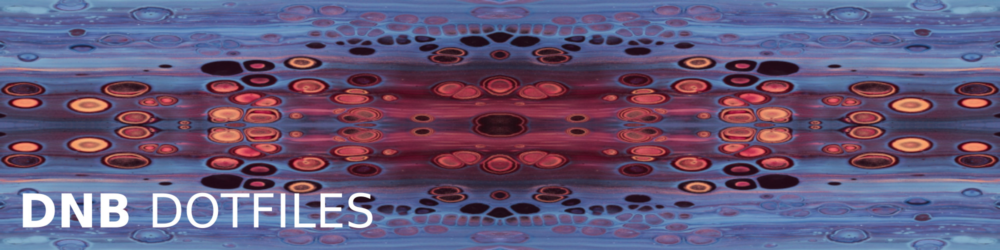

# The Dot-Files of @davidsneighbour

- [Introduction](#introduction)
- [Setup](#setup)
- [Update](#update)
- [Other Details](#other-details)
- [LICENSE](#license)

> [!CAUTION]
> While this repo is public and licensed under MIT you probably do NOT want to just clone it and use it as a template for your own project. Feel free to look around and take inspiration as I did with plenty of dotfile repository before me. This is my personal setup and it works for me. If you have questions or suggestions (or find me adding my own private keys to this repo) feel free to contact me or peruse the issues section.

## Introduction

See the note above. If you are still here, then you probably are interested in how I optimize my daily work with my system and these files are the result of that. I try to abide by some rules and principles to make my life easier:

- I use [GNU Bash](https://www.gnu.org/software/bash/) (on my system currently v5.2+). I don't use any fancy new and better shell, just `/bin/bash`. I use it because it is the most widely used shell and it is the default shell on my system. I use it because all my linting tools and subscripts are written or configured for bash. I am not required to reinvent the wheel. (The last sentence is something I repeat to myself once a day or more often.)

- If functionality is available within Bash itself, I will use _this_ functionality, not an additional program or package that needs to be installed and might not be available on other systems.

- Speed is subjective. 1 second is not slow. 5 seconds is not slow. I will not optimize my scripts to save nanoseconds and will enjoy the time spent waiting for my scripts to finish.

- I will document most of the features within the scripts themselves. I will not document the features in the README.md file or only mention them in a drive-by.

## Setup

> [!CAUTION]
> Again: You do not want to directly set up this repository on your own system. Clone it to learn, then create your own .dotfiles setup.

**Step 1:** Clone with submodules:

```bash
git clone --recurse-submodules git@github.com:davidsneighbour/dotfiles.git
```

**Step 2:** Install dependencies:

```bash
npm install
```

**Step 3:** Run initial setup:

```bash
./dotbot.sh install
```

**Step 4 (optional):** Set up protected files. 

This is a "self-invented" feature that allows me to put protected files (like .env) into a safe repository. The files are not stored in *this* repo and encryption and privacy is handled separtedly. The protected files reside in a submodule/git repository that is located in `protected/`. 

```bash
git clone protected-repo-path protected
./dotbot.sh protected
```

## Update

Run consecutive updates:

```bash
git pull
./dotbot.sh
./dotbot.sh protected # if you have set up protected files (see step 4)
git submodule update --recursive --remote --merge --force
```

Updating dotbot submodules is a bit tricky and might not work all times. Running into issues the following will help:

```bash
cd broken-submodule-path
git merge --abort
git pull
git checkout main # or whatever branch the main branch is
```

## Other Details

- [Key Bindings](documentation/keybindings.md)

## LICENSE

As far as components of this project are licensable this is done so under the MIT License – see the [LICENSE](LICENSE.md) file for details. Again… use at your own risk.
