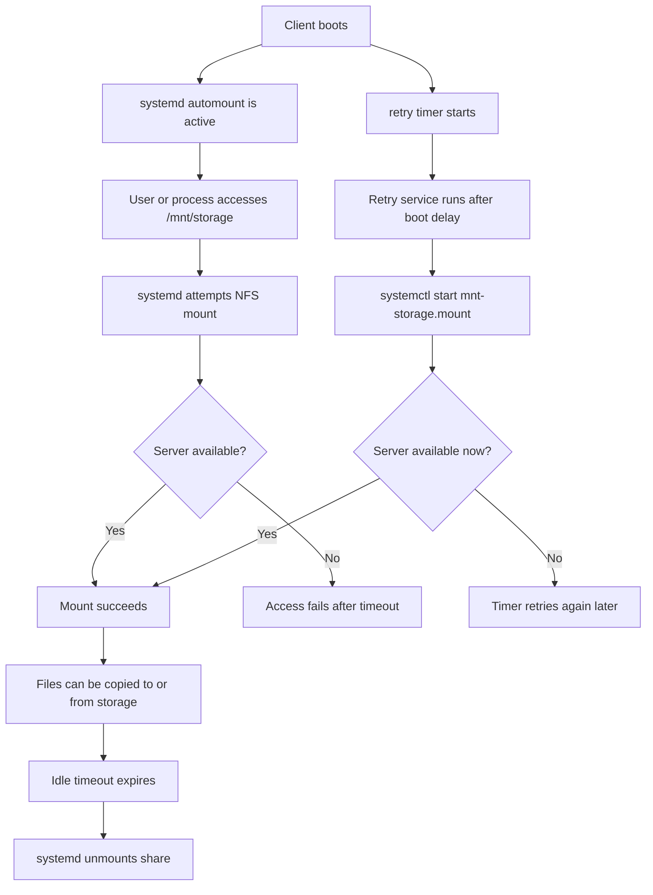

# NFS storage setup

This script configures a simple Linux-to-Linux NFS storage setup for a shared directory.

It is designed for the following workflow:

* computer 1 exports a storage path over the local network
* computer 2 mounts that path on demand
* files are copied to or from the mounted storage
* documents and media are then worked on locally, not directly on the network share

That is a good fit for NFS. It keeps the setup simple, fast, and close to normal Linux filesystem behaviour.

## What this setup does

### Server mode

In `--server` mode, the script can:

* install the NFS server package
* create and prepare the export path
* write an export definition into `/etc/exports.d/storage.exports`
* reload the NFS server and export table

### Client mode

In `--client` mode, the script can:

* install the NFS client package
* create the mount point
* write a `systemd` mount unit
* write a `systemd` automount unit
* write a retry service and timer
* reload `systemd`
* enable the automount and retry timer

## Why this setup uses systemd automount

The client side does not try to mount the remote storage permanently during boot.

Instead:

* boot continues normally even if the server is offline
* the mount is attempted only when `/mnt/storage` is accessed
* the mount will unmount again after idle time
* a retry timer attempts mounting again after boot if the server was not yet ready

This avoids boot delays and handles the common case where both computers start at roughly the same time.

## Default layout

### Server

* host: `192.168.1.201`
* export path: `/mnt/storage`

### Client

* mount point: `/mnt/storage`

### Ownership

* UID: `1000`
* GID: `1000`

### Allowed network

* `192.168.1.0/24`

## Files written by the script

### Server

* `/etc/exports.d/storage.exports`

### Client

* `/etc/systemd/system/mnt-storage.mount`
* `/etc/systemd/system/mnt-storage.automount`
* `/etc/systemd/system/mnt-storage-retry.service`
* `/etc/systemd/system/mnt-storage-retry.timer`

## Workflow overview



## Installation

Make the script executable:

```bash
chmod +x nfs-storage-setup.sh
```

## Usage

### Show help

```bash
./nfs-storage-setup.sh --help
```

### Server: install required packages

```bash
./nfs-storage-setup.sh --server --setup
```

### Server: write export configuration

```bash
./nfs-storage-setup.sh --server --setup-daemon
```

### Server: reload NFS after changes

```bash
./nfs-storage-setup.sh --server --reload
```

### Server: do everything in one go

```bash
./nfs-storage-setup.sh --server --setup --setup-daemon --reload
```

### Client: install required packages

```bash
./nfs-storage-setup.sh --client --setup
```

### Client: write systemd units

```bash
./nfs-storage-setup.sh --client --setup-daemon
```

### Client: reload systemd and enable units

```bash
./nfs-storage-setup.sh --client --reload
```

### Client: do everything in one go

```bash
./nfs-storage-setup.sh --client --setup --setup-daemon --reload
```

## Customisation

The script supports a small set of configuration overrides.

### Use a different server IP

```bash
./nfs-storage-setup.sh --client --server-ip 192.168.1.201 --setup-daemon --reload
```

### Use a different allowed network on the server

```bash
./nfs-storage-setup.sh --server --allowed-network 192.168.1.0/24 --setup-daemon --reload
```

### Use different ownership

```bash
./nfs-storage-setup.sh --server --uid 1000 --gid 1000 --setup-daemon --reload
./nfs-storage-setup.sh --client --uid 1000 --gid 1000 --setup-daemon --reload
```

## Current limitation

This script currently assumes the client mount point is exactly:

```text
/mnt/storage
```

That is because `systemd` unit filenames are path-derived and are currently hard-coded as:

* `mnt-storage.mount`
* `mnt-storage.automount`

If you want to support arbitrary mount points, the script should be extended to generate the correct escaped unit names automatically.

## What the retry timer does

The client retry timer is configured like this:

* first retry: about 2 minutes after boot
* later retries: every 3 minutes

This is useful when both machines are started at the same time and the server or attached disk is not ready immediately.

Even if the retry timer misses the first successful moment, the automount will still mount the share later when `/mnt/storage` is accessed.

## Verifying the setup

### On the server

Check exports:

```bash
sudo exportfs -v
```

Check service status:

```bash
sudo systemctl status nfs-kernel-server
```

### On the client

Check automount:

```bash
systemctl status mnt-storage.automount
```

Check retry timer:

```bash
systemctl status mnt-storage-retry.timer
```

Trigger a mount attempt:

```bash
ls /mnt/storage
```

Check whether it mounted:

```bash
mount | grep '/mnt/storage'
```

## Behaviour notes

* If the server is offline during boot, the client still boots normally.
* If the server becomes available later, the retry timer and future access attempts can mount it.
* If the server disappears during an active write operation, NFS can still stall that write. That is normal for network filesystems.
* This setup is intended for storing and copying files, not for editing directly on the remote storage.

## Security and scope

This setup is intended for a trusted local network.

The default export line allows the full local subnet:

```text
/mnt/storage 192.168.1.0/24(rw,sync,no_subtree_check)
```

If you want tighter control, restrict it to a single client IP instead.

Example:

```text
/mnt/storage 192.168.1.202(rw,sync,no_subtree_check)
```

## Package summary

### Server

```bash
sudo apt install nfs-kernel-server
```

### Client

```bash
sudo apt install nfs-common
```

## Typical setup order

### On computer 1

```bash
./nfs-storage-setup.sh --server --setup --setup-daemon --reload
```

### On computer 2

```bash
./nfs-storage-setup.sh --client --setup --setup-daemon --reload
```

## Troubleshooting

### The client does not mount anything

Check:

* server is online
* external drive is actually mounted on the server at `/mnt/storage`
* NFS export is active on the server
* client can reach `192.168.1.201`
* `mnt-storage.automount` is enabled
* `mnt-storage-retry.timer` is enabled

### Quick checks

On the server:

```bash
sudo exportfs -v
```

On the client:

```bash
systemctl status mnt-storage.automount
systemctl status mnt-storage-retry.timer
journalctl -u mnt-storage.mount -u mnt-storage.automount -u mnt-storage-retry.service -u mnt-storage-retry.timer -f
```

## ToDo

* add a `--dry-run` mode
* add backups of replaced configuration files
* add a client-side connectivity test command
